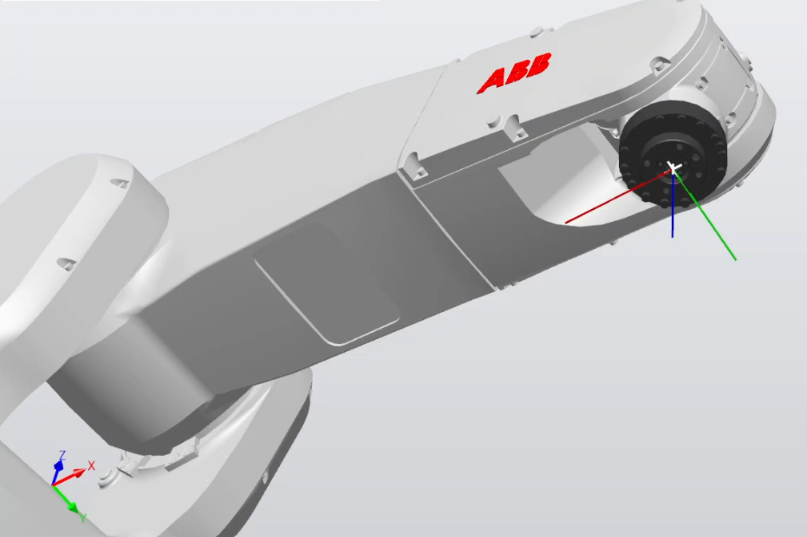

# ABB Industrial Robot Control (Python/RAPID)
**Context:** Mercer X Lab (Academic Module) | **Hardware:** ABB IRB 1200 (Simulated) | **Controller:** IRC5 (Virtual)

## 1. Project Overview
This repository documents the **Offline Programming (OLP)** implementation of an external control bridge for an ABB IRB 1200, simulated within **ABB RobotStudio**.

Unlike standard teach-pendant programming, this project validates a client-server architecture where a Python driver executes complex motion primitives (MoveL, MoveJ) via Ethernet to the **Virtual Controller (VC)**.

**System Objectives:**
* **Virtual Commissioning:** Validating TCP/IP socket communication and RAPID logic in a risk-free digital environment.
* **Trajectory Analysis:** Verifying kinematic constraints and path accuracy using the RobotStudio physics engine.

## 2. Demo

*(Note: Click the image above to play the video demo. Execution of a 100mm square trajectory. The robot utilizes z50 zoning for high-speed corner blending and fine points for precision starts/stops.)*

## 3. System Architecture & Tech Stack

### Controller Configuration (IRC5)
To enable external control, the standard robot controller was **configured** with specific software options to match the Mercer X Lab "Smart Factory" standard:
* **616-1 PC Interface:** Enables Ethernet socket communication, allowing the robot to act as a server.
* **623-1 Multitasking:** Configured to execute background tasks (monitoring & logging) parallel to the main motion pointer.
* **Configuration Management:**
    * `SYS.cfg`: Configured the controller to auto-load semi-static background tasks at startup.
    * `EIO.cfg`: Defined the "virtual wiring" (Analog/Digital Outputs) for handshake signals.

### Middleware Logic (State Machine)
The system **utilizes** a RAPID `RECORD` structure (`motion_program_state_type`) to serve as a shared memory block. This acts as a request-response state machine, ensuring deterministic communication between the asynchronous Python script and the real-time robot controller.

## 4. Key Engineering Implementations

### A. Frame Definition (TCP & Work Objects)
Decoupled the motion path from the robot's physical base to ensure portability:
* **Tool Data (`tooldata`):** Defined Tool Center Point (TCP) at `z=100mm` from the flange.
* **Work Object (`wobjdata`):** Established a fixed user coordinate system at `[600, 0, 550]`, allowing for relative path planning.

### B. Motion Zoning Strategy
Utilized specific zone data to balance cycle time vs. trajectory fidelity:
* **`z50` (Zone 50mm):** Used for continuous path cornering (blending) to maintain high velocity.
* **`fine`:** Used for start/stop target convergence to ensure sub-millimeter precision.

## 5. Safety Protocols (ISO 10218 Aligned)
Verified safety integration concepts required for collaborative workspaces:
* **E-Stop Logic:** Mapped hardware interrupts to Category 0/1 stops.
* **Recovery Sequence:** Validated the standard "Deadman Switch" and "Motor On" hardware sequence required to resume control.

## 6. Telemetry & Validation
Real-time feedback from the virtual controller is captured to verify path adherence. The graph below demonstrates the **Joint Position vs. Time** response, confirming that the simulator is accurately tracking the Python-generated trajectory.

