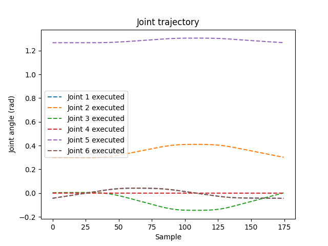

# ABB Industrial Robot Control (Python/RAPID)
**Hardware:** ABB IRB 1200 (Simulated in RobotStudio) | **Controller:** IRC5 (Virtual) | **Middleware:** RPI abb-motion-program-exec

## 1. Project Overview
This repository documents the architecture and implementation of an external control bridge for an ABB IRB 1200 industrial robot. Unlike standard teach-pendant programming, this project establishes a **client-server architecture** where a custom Python driver executes complex motion primitives (`MoveL`, `MoveJ`, `MoveC`) dynamically via Ethernet.

The system allows for "Sim-to-Real" workflow validation, generating RAPID trajectories in Python and executing them deterministically on the IRC5 controller.

## 2. Demo

*(Note: Execution of a 100mm square trajectory. The robot utilizes z50 zoning for high-speed corner blending and fine points for precision starts/stops, as defined in the Python motion primitives.)*

## 3. System Architecture & Tech Stack

### Controller Configuration (IRC5)
To enable external control, the standard robot controller was architected with specific software options and background tasks:
* **616-1 PC Interface:** Enabled Ethernet socket communication, allowing the robot to act as a server for the Python client.
* **623-1 Multitasking:** Configured to execute background tasks (monitoring & logging) parallel to the main motion pointer.
* **Configuration Management:**
    * `SYS.cfg` (System Parameters): Configured the controller to auto-load semi-static background tasks (`logger` and `error_reporter`) at startup.
    * `EIO.cfg` (I/O System): Defined the "virtual wiring" (Analog/Digital Outputs) that acts as the handshake signals between the RAPID environment and Python.

### Middleware Logic (State Machine)
Implemented a `RECORD` structure in RAPID (`motion_program_state_type`) to serve as a shared memory block. This acts as a request-response state machine, ensuring deterministic communication between the asynchronous Python script and the real-time robot controller.

## 4. Key Engineering Implementations

### A. Frame Definition (TCP & Work Objects)
Decoupled the motion path from the robot's physical base to ensure portability:
* **Tool Data (`tooldata`):** Defined Tool Center Point (TCP) at `z=100mm` from the flange to simulate a welding end-effector.
* **Work Object (`wobjdata`):** Established a fixed user coordinate system at `[600, 0, 550]`, allowing for relative path planning independent of the robot's mounting position.

### B. Motion Zoning Strategy
Utilized specific zone data to balance cycle time vs. trajectory fidelity:
* **`z50` (Zone 50mm):** Used for continuous path cornering (blending) to maintain high velocity.
* **`fine`:** Used for start/stop target convergence to ensure sub-millimeter precision at waypoints.

## 5. Safety Protocols (ISO 10218 Aligned)
Verified safety integration required for collaborative workspaces:
* **E-Stop Logic:** Mapped hardware interrupts to Category 0/1 stops.
* **Recovery Sequence:** Validated the physical "Deadman Switch" and "Motor On" hardware sequence required to resume Python control after a safety violation.

## 6. Telemetry & Validation
Real-time feedback from the controller is captured to verify path adherence. The graph below demonstrates the **Joint Position vs. Time** response, confirming that the physical robot (or simulator) is accurately tracking the Python-generated trajectory without packet loss or jitter.

